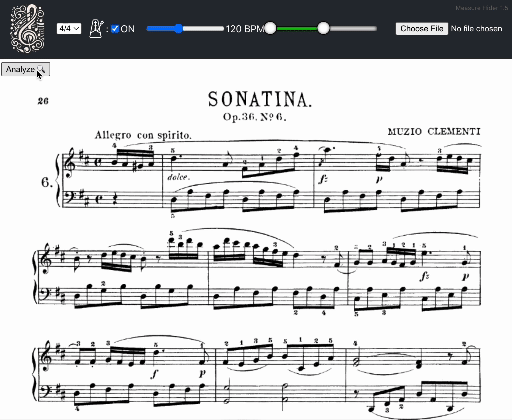

# Measure Hider

A web application for hiding measures as you play along to sheet music.



## About

Measure Hider is a web application designed for musicians to enhance their sight-reading skills by providing an interactive and unique way to play along with sheet music. With Measure Hider, you can upload your own PDF sheet music, and the application will automatically detect and divide the music into individual measures. It offers a one-of-a-kind learning experience that focuses on improving your lookahead skills while sight-reading.

**Key Features:**

- **Hide Measures:** Measure Hider allows you to hide specific measures of the sheet music as you play along. This feature encourages you to read ahead and anticipate upcoming notes and rhythms, a crucial skill for sight-reading.

- **PDF Upload:** Easily upload your own sheet music in PDF format. The application's automated measure detection ensures that your music is accurately divided into measures for interactive control.

- **Enhanced Learning:** The animated transitions and dynamic interface of Measure Hider make practicing and learning music more engaging and enjoyable.

**Why Measure Hider Is Useful:**

- **Sight-Reading Improvement:** Measure Hider's unique approach to hiding measures challenges you to read ahead while playing, a skill that is essential for sight-reading music accurately.

- **Customizable Practice:** Tailor your practice sessions by selecting which measures to hide or reveal. Focus on the sections that need improvement and gradually increase the difficulty as you progress.

- **No Similar Tool:** As of now, there are no comparable tools available on the internet that offer the same combination of automatic measure detection, PDF support, and interactive measure hiding.

Discover a new way to practice and improve your sight-reading skills with Measure Hider.

## Usage

Follow the on-screen instructions.  Pro-tip: use a bookmarklet to instantly redirect pdfs in your browser to Measure Hider.  Bookmarklet code:
```javascript
javascript:(function(){const currentUrl='https://corsproxy.io/?%27+encodeURIComponent(window.location.href);if(currentUrl.endsWith(%27.pdf%27)){window.open(%27https://<SERVER-URL>/measure-hider/?url=%27+encodeURIComponent(currentUrl));}else{alert(%27Not a PDF URL%27);}})();
```

## Development Information
### Project Organization

The project is organized into several key directories and files to ensure easy navigation and understanding of the codebase. Here's an overview of the file structure and the purpose of each component:

- **client/** - This directory contains the React code for the frontend of the application.
- **model/** - Houses the modeling code. This is where the YOLO model and related machine learning code are located.
- **server/** - Contains a WSGI server that uses the model created in the 'model' directory to serve AJAX requests for the client code.
- **build/** - The production directory. It contains the build the final build.

Each directory is structured to maintain a separation of concerns, ensuring that the frontend, backend, and model training aspects of the project are distinct and easily manageable.

### Installation

The installation and running of the project are currently handled through an ad-hoc series of steps. Follow these instructions to set up and run a test server on your machine:

1. **Prepare the Server Directory:**
   - Run `make build`.

5. **Run the Test Server:**
   - You can now run a test server on your machine. In the `build` directory, use the command `python measure_hider_modeler.py` to start the server.

These steps will set up both the client and server sides of the application, allowing you to run a test server locally for development and testing purposes.
